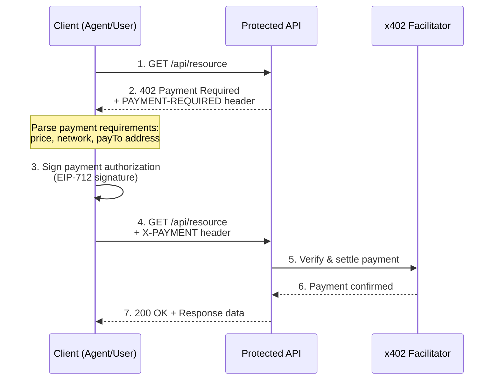
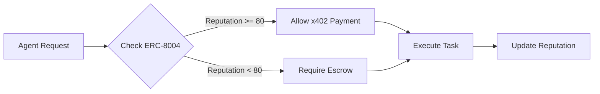

# x402 Workshop: HTTP Native Payments for the Agent Economy

To start you own x402 project use:

```shell
npx create-eth@latest -e scaffold-eth/create-eth-extensions:x402
```

---

## Table of Contents

1. [The Problem](#1-the-problem)
2. [What is x402?](#2-what-is-x402)
3. [The x402 Payment Flow](#3-the-x402-payment-flow)
4. [Code Walkthrough](#4-code-walkthrough)
5. [ERC-8004: Identity & Reputation](#5-erc-8004-identity--reputation)
6. [Quickstart](#6-quickstart)
7. [Hackathon Resources](#7-hackathon-resources)
8. [The Future: Agentic Commerce](#8-the-future-agentic-commerce)

---

## 1. The Problem

The internet was built without a native payment layer.

### The Archaic Payment System

Even though modern payments _feel_ fast and seamless, they actually go through incredibly old systems:

- **Slow settlement** - Moving money takes forever, often days to truly settle
- **Excessive fees** - PayPal takes **$0.56** on a **$1 donation** (you receive only 44¢)
- **Many middlemen** - Each transaction passes through multiple intermediaries
- **Trust required** - Preset accounts, credit cards, and identity verification needed

**This makes micropayments impossible.** The archaic system simply wasn't designed to move small amounts of money.

### The Agent Problem

| Challenge       | Human Solution                               | Agent Problem                               |
| --------------- | -------------------------------------------- | ------------------------------------------- |
| Paying for APIs | Credit cards, subscriptions                  | Agents can't fill forms or do KYC           |
| Micropayments   | High fees make $0.01 transactions impossible | Agents need high-frequency, low-value calls |
| Authentication  | Accounts, sessions, tokens                   | Agents need stateless, programmatic access  |

Agents are becoming major players on the internet - they can do all sorts of things, but they **cannot use the archaic payment system**. They need an internet-native payment layer.

**Result:** The internet lacks a native payment protocol that works for both humans and agents.

---

## 2. What is x402?

**x402 is a universal language for internet payments.**

It brings back [HTTP 402 Payment Required](https://developer.mozilla.org/en-US/docs/Web/HTTP/Reference/Status/402) - a status code reserved since 1999 but never standardized. The name "x402" comes directly from this HTTP error code.

It's a language that everybody understands, spoken through simple HTTP. Both parties can agree on an exchange - "I pay you this amount, you give me this product" - with:

- **No trust required** between parties
- **No preset accounts** or credit cards needed
- **No keys or sessions** to manage
- **Instant settlement** - payment confirmed immediately
- **Super low fees** - micropayments actually work

### Key Features

| Feature            | Description                                   |
| ------------------ | --------------------------------------------- |
| **HTTP Native**    | Payments happen inside request/response cycle |
| **No Accounts**    | Access services without signup                |
| **Micropayments**  | Pay $0.01 per request - no minimums           |
| **Chain Agnostic** | Works on Base, Solana, and more               |
| **Agent Ready**    | Programmatic, stateless, automatable          |

**Great for humans. Great for agents.**

### Who Uses x402?

- **Sellers:** API providers, content creators, service operators
- **Buyers:** AI agents, developers, automated systems, anyone on the internet

---

## 3. The x402 Payment Flow



### The Headers

| Header             | Direction       | Purpose                                        |
| ------------------ | --------------- | ---------------------------------------------- |
| `PAYMENT-REQUIRED` | Server → Client | Base64-encoded JSON with price, network, payTo |
| `X-PAYMENT`        | Client → Server | Signed payment authorization                   |
| `PAYMENT-RESPONSE` | Server → Client | Settlement confirmation                        |

---

## 4. Code Walkthrough

This repo demonstrates x402 with a "KL Insider Guide" - premium content unlocked for $0.01 USDC.

### Project Structure

```
packages/
├── nextjs/
│   ├── middleware.ts          # x402 paywall configuration
│   ├── app/
│   │   ├── api/payment/builder/route.ts  # Protected API
│   │   └── payment/builder/page.tsx      # Protected page
│   └── data/
│       ├── klFacts.ts         # Premium content
│       └── klHiddenGems.ts    # More premium content
└── hardhat/
    └── scripts/
        └── send402request.ts  # CLI client example
```

---

### Step 1: Middleware Configuration

📄 **File:** [`packages/nextjs/middleware.ts`](packages/nextjs/middleware.ts)

This is where you define which routes require payment:

```typescript
import { HTTPFacilitatorClient, x402ResourceServer } from "@x402/core/server";
import { registerExactEvmScheme } from "@x402/evm/exact/server";
import { paymentProxy } from "@x402/next";
import { createPaywall } from "@x402/paywall";
import { evmPaywall } from "@x402/paywall/evm";

// Create facilitator client (handles verification & settlement)
const facilitatorClient = new HTTPFacilitatorClient({
  url: facilitatorUrl,
});

// Register payment scheme
const server = new x402ResourceServer(facilitatorClient);
registerExactEvmScheme(server);

// Create paywall UI
const paywall = createPaywall()
  .withNetwork(evmPaywall)
  .withConfig({
    appName: "Next x402 Demo",
    testnet: isTestnet,
  })
  .build();

// Configure protected routes
export const middleware = paymentProxy(
  {
    "/api/payment/builder": {
      accepts: [
        {
          scheme: "exact",
          price: "$0.01",
          network: "eip155:84532", // Base Sepolia
          payTo,
        },
      ],
      description: "Access to protected API content",
      mimeType: "application/json",
    },
  },
  server,
  undefined,
  paywall,
);
```

**Key Concepts:**

- `paymentProxy` wraps your routes with payment requirements
- `scheme: "exact"` means exact amount required (vs streaming, subscription, etc.)
- `network: "eip155:84532"` is CAIP-2 format (chain standard identifier)

---

### Step 2: Protected API Route

📄 **File:** [`packages/nextjs/app/api/payment/builder/route.ts`](packages/nextjs/app/api/payment/builder/route.ts)

Your API code stays clean - no payment logic needed:

```typescript
import { NextResponse } from "next/server";
import { KL_FACTS, shuffleFacts } from "~~/data/klFacts";

export async function GET() {
  // This only runs AFTER payment is verified
  const selectedFacts = shuffleFacts(KL_FACTS).slice(0, 3);

  return NextResponse.json({
    title: "Kuala Lumpur Insider Facts",
    paidContent: true,
    facts: selectedFacts,
  });
}
```

The middleware handles the 402 response automatically. Your code just serves content.

---

### Step 3: Client-Side Payment

📄 **File:** [`packages/hardhat/scripts/send402request.ts`](packages/hardhat/scripts/send402request.ts)

For agents/scripts to make payments programmatically:

```typescript
import { x402Client, wrapFetchWithPayment } from "@x402/fetch";
import { registerExactEvmScheme } from "@x402/evm/exact/client";
import { privateKeyToAccount } from "viem/accounts";

// Setup signer
const signer = privateKeyToAccount(privateKey);

// Create x402 client
const client = new x402Client();
registerExactEvmScheme(client, { signer });

// First request - expect 402
const response = await fetch(URL);
// Response status: 402
// Parse PAYMENT-REQUIRED header for payment details

// Wrap fetch with automatic payment handling
const fetchWithPayment = wrapFetchWithPayment(fetch, client);

// Second request - payment handled automatically
const paidResponse = await fetchWithPayment(URL);
// Response status: 200
// Content unlocked!
```

---

### Step 4: Environment Configuration

📄 **File:** [`packages/nextjs/.env.development`](packages/nextjs/.env.development)

```bash
# x402 Facilitator (handles settlement)
NEXT_PUBLIC_FACILITATOR_URL=https://x402.org/facilitator

# CAIP-2 network identifier
NETWORK=eip155:84532  # Base Sepolia

# Your wallet to receive payments
RESOURCE_WALLET_ADDRESS=0x...
```

---

## 5. ERC-8004: Identity & Reputation

While x402 handles **payments**, ERC-8004 handles **trust**.

### The Three Registries

| Registry       | Purpose                    | Use Case                                |
| -------------- | -------------------------- | --------------------------------------- |
| **Identity**   | Who is the agent?          | ERC-721 NFT per agent                   |
| **Reputation** | How well did they perform? | Scores 0-100 from verified interactions |
| **Validation** | Can they do the job?       | Third-party capability proofs           |

### Combining x402 + ERC-8004



**Example Middleware Logic:**

```typescript
// Pseudocode for trust-gated payments
if (agentReputation >= threshold && stakedAmount >= minStake) {
  // Allow direct x402 payment
  proceed();
} else {
  // Require escrow or additional verification
  requestEscrow();
}
```

### ERC-8004 Resources

| Resource      | Link                                                            |
| ------------- | --------------------------------------------------------------- |
| Official Site | [8004.org](https://www.8004.org/)                               |
| EIP Spec      | [EIP-8004](https://eips.ethereum.org/EIPS/eip-8004)             |
| Explorer      | [8004scan.io](https://www.8004scan.io/)                         |
| Awesome List  | [awesome-erc8004](https://github.com/sudeepb02/awesome-erc8004) |

---

## 6. Quickstart

### Prerequisites

- Node.js >= v20.18.3
- Yarn v1 or v2+
- Git

### Installation

```bash
# Clone this repo or create fresh
npx create-eth@latest -e scaffold-eth/create-eth-extensions:x402
cd your-project-name

# Install dependencies
yarn install
```

### Run the Demo

```bash
# Terminal 1: Start frontend
yarn start
```

Visit `http://localhost:3000` and click "Unlock Now" to see the paywall.

### Test API Payment (CLI)

```bash
# Generate a deployer account (if you don't have one)
yarn generate

# Fund your account with test USDC
# Visit: https://faucet.circle.com/

# Send a paid request
yarn send402request
```

### Configuration

Edit `packages/nextjs/.env.development`:

```bash
NEXT_PUBLIC_FACILITATOR_URL=https://x402.org/facilitator
NETWORK=eip155:84532                    # Base Sepolia
RESOURCE_WALLET_ADDRESS=0xYourWallet    # Payment receiver
```

---

## 7. Hackathon Resources

### x402 Documentation

| Resource      | Link                                                                     |
| ------------- | ------------------------------------------------------------------------ |
| Official Site | [x402.org](https://www.x402.org/)                                        |
| Documentation | [docs.cdp.coinbase.com/x402](https://docs.cdp.coinbase.com/x402/welcome) |
| GitHub        | [github.com/coinbase/x402](https://github.com/coinbase/x402)             |
| Ecosystem     | [x402.org/ecosystem](https://www.x402.org/ecosystem)                     |

### Hackathon Tracks

| Track                        | Description                        |
| ---------------------------- | ---------------------------------- |
| **A: x402 Products**         | Build paid APIs/services (easiest) |
| **B: Trust-Gated Payments**  | Combine x402 + ERC-8004 middleware |
| **C: Discovery Index**       | Build an "Agent App Store"         |
| **D: Capability Benchmarks** | Verify agent capabilities          |

### Key Requirements

- Must include x402 payment flow
- Must be demoable
- Must ship working code
- ERC-8004 integration strongly encouraged

### What to Build

- Pay-per-request APIs (trading signals, web scraping, data transforms)
- Compute-on-demand (VM, sandbox, GPU minutes)
- Trust middleware (reputation checks before payment)
- Agent discovery services

---

## 8. The Future: Agentic Commerce

We're entering a world where agents don't just assist - they **act autonomously**.

### The Vision

Today's agents like Claude Opus 4.5 are incredibly capable. You can give them a goal and they'll work for hours or days. But they're limited without tools - specifically, without the ability to **pay for valuable services**.

Here's what's coming:

```
Agent receives goal → Finds capability it lacks → Discovers API that can help
    → Pays for it with x402 → Gets the job done → Returns result
```

### The Opportunity

Every payable capability or service will have:

- **A reputation/rating** from verified interactions
- **Competing prices** across providers
- **Discoverable endpoints** that agents can find

Agents will choose the best-rated, best-priced option automatically.

**If you equip your service with internet-native payments, you're opening it up to agentic commerce.**

### Why Build Now?

This wave of agentic commerce is coming faster than we think. If you're here today, you're early.

- Build valuable capabilities that agents need
- Give agents money, and they'll find any resource possible
- The more brains on this, the more cool ideas we'll see

---

## Built With

- [Scaffold-ETH 2](https://scaffoldeth.io) - Ethereum development stack
- [x402](https://x402.org) - HTTP native payments
